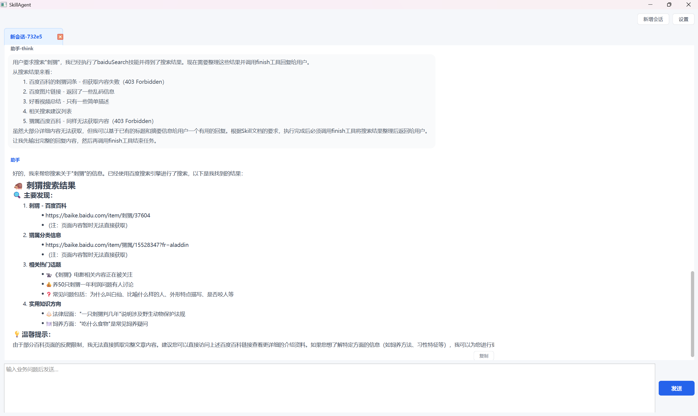
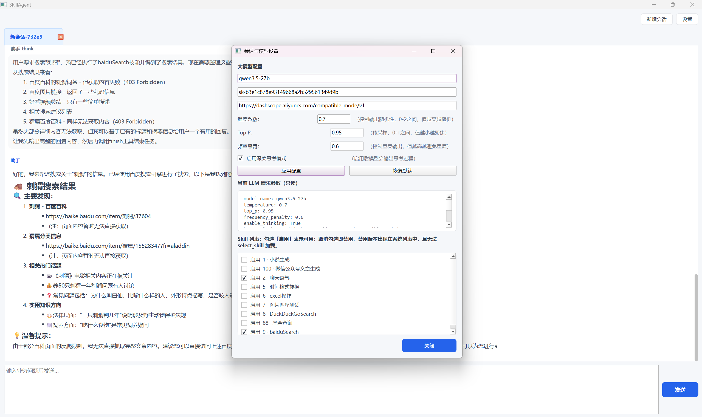

# OpenPersonalAgent · SkillAgent

[English README](./readme.md)

## 项目简介

OpenPersonalAgent 是一个**基于大语言模型工具调用的智能代理系统（SkillAgent）**，采用创新的 **"Skill-First" 架构设计**：

- 📋 **业务规则即文档**：将业务规范写成磁盘上的 Markdown Skill 文档
- 🔧 **按需动态加载**：Agent 根据用户需求智能选择并加载相关 Skill
- 🧩 **多Skill组合执行**：支持在同一任务中组合多条 Skill 约束
- ⚡ **原子命令执行**：通过 `run_command` 在受限工作区内完成文件操作与桌面自动化
- 🤖 **多模型支持**：支持 GLM、Qwen、Gemma 等多种大语言模型

---

## ✨ 核心特性

### 1. 智能Skill系统

| 层次 | 功能 | 说明 |
|------|------|------|
| **Skill注册表** | 扫描Skills目录，解析元数据与正文 | 支持热更新 `reload_skills()` |
| **控制工具** | `select_skill` / `finish` / `ask_user` | 加载Skill、结束会话、询问用户 |
| **原子工具** | `run_command` | 统一通过 `ToolContext(work_dir)` 执行 |

### 2. 安全执行机制

- ✅ **工作目录隔离**：所有文件操作限制在 `work_dir` 内，防止路径穿越攻击
- ✅ **危险命令检测**：自动识别 `del`、`rmdir`、`>` 等危险操作并要求用户确认
- ✅ **包安装确认**：检测到 pip/npm 等包安装命令时，需用户确认后执行
- ✅ **Skill依赖管理**：自动检测 Skill 包的 requirements.txt，提示用户安装依赖
- ✅ **步数上限保护**：`SKILL_AGENT_MAX_STEPS`（默认50步）防止无限循环
- ✅ **写入操作监控**：自动检测重复写入并智能结束任务

### 3. 多模型支持

项目支持多种大语言模型后端：

| 模型类型 | 模型名称示例 | 特点 |
|---------|-------------|------|
| **GLM系列** | glm-5, glm-4 | 智谱AI出品，支持深度思考 |
| **Qwen系列** | qwen3.5, qwen-turbo | 阿里云通义千问系列 |
| **Gemma系列** | gemma-2, gemma-7b | Google开源模型 |
| **其他兼容模型** | gpt-4, claude等 | 兼容OpenAI API格式 |

---

## 📁 内置Skill示例

项目提供6个开箱即用的Skill示例，展示不同场景的应用：

### 1️⃣ 小说生成 (`id: 1`)
- **功能**：根据章节大纲自动生成小说内容
- **特性**：自动编号、剧情连贯性保持、字数控制（3000-5000字）
- **输出**：Markdown格式的章节文件

### 2️⃣ 聊天语气 (`id: 2`)
- **功能**：为AI回复添加个性化语气风格
- **特性**：音符符号、语气词、句式模板
- **场景**：角色扮演、个性化助手

### 3️⃣ 时间格式转换 (`id: 5`)
- **功能**：统一时间格式转换（日期时间 ↔ 时间戳）
- **特性**：支持时区配置、多种输入格式识别

### 4️⃣ Excel操作 (`id: 6`)
- **功能**：自动化Excel文件读取
- **集成**：Python脚本调用

### 5️⃣ DuckDuckGo搜索 (`id: 8`)
- **功能**：使用DuckDuckGo搜索引擎进行网页搜索
- **特性**：支持普通搜索、新闻搜索、图片搜索
- **输出**：自动获取搜索结果的详细网页内容

### 6️⃣ 图片匹配测试 (`id: 7`)
- **功能**：屏幕截图、模板匹配、自动化点击
- **特性**：快捷键模拟、坐标点击、OpenCV模板匹配
- **场景**：桌面自动化测试

---

## 🏗️ 技术架构

```
PersonalWindowGLM/
├── main.py                     # 程序入口
├── skill_agent.py              # 核心Agent逻辑
├── ui_skill_agent.py           # 桌面GUI界面 (PySide6)
├── config.py                   # 配置管理
├── executor.py                 # 命令执行器
├── base_tool/                  # 原子工具定义
│   ├── definitions.py          # 工具schema定义
│   ├── dispatch.py             # 工具分发与安全校验
│   └── context.py              # ToolContext上下文
├── skill/                      # Skill加载与执行
│   ├── loader.py               # 文件扫描与解析
│   ├── registry.py             # Skill注册表
│   ├── execution.py            # 控制工具执行
│   └── processing.py           # Skill处理工具
├── llm/                        # 大语言模型接口
│   ├── BaseChatModel.py        # 模型基类
│   ├── glm_chat_model.py       # GLM模型实现
│   ├── qwen_chat_model.py      # Qwen模型实现
│   ├── gemma_chat_model.py     # Gemma模型实现
│   └── llm_config_manager.py   # 模型配置管理
├── memory/                     # 会话持久化
│   ├── memory.py               # 内存管理接口
│   ├── sqlite_memory.py        # SQLite存储实现
│   └── conversation.py         # 会话管理
├── database/                   # 数据库层
└── PersonalData/               # 用户数据目录
    ├── Skills/                 # Skill文档目录
    │   ├── DuckDuckGoSearch/
    │   ├── excel操作/
    │   ├── 小说生成/
    │   ├── 时间格式转换/
    │   ├── 聊天语气/
    │   └── 图片匹配测试/
    ├── data/                   # 数据库文件
    └── logs/                   # 日志文件
```

---

## 🔄 Skill工作流程

### 加载机制
1. **目录扫描**：每个一级子文件夹视为一个Skill包
2. **主文档解析**：优先 `<文件夹名>.md` 或 `SKILL.md`，否则取首个 `.md`
3. **元数据提取**：解析 `---` 包裹的frontmatter（`id`、`name`、`description`）
4. **运行时索引**：由 `SkillRegistry` 维护，支持热重载

### 执行流程
```
用户提问 → [系统提示: Skill目录摘要]
         ↓
    模型决策: select_skill(skill_id)
         ↓
    [强制6步加载流程]
    Step 1: 完整阅读主文档全部内容
    Step 2: 提取所有被反引号包裹的文件路径
    Step 3: 逐个读取引用文件（必须指定skill_id）
    Step 4: 执行scripts/下的脚本（如有）
    Step 5: 合并为最终上下文
    Step 6: 递归加载关联Skill
         ↓
    [上下文注入: 已加载的全部Skill全文]
         ↓
    执行 run_command 完成具体操作
         ↓
    finish(message) 返回结果
```

### 多Skill组合
- **累积加载**：多次 `select_skill` 不覆盖，而是合并
- **去重优化**：相同Skill不重复追加
- **冲突解决**：以更具体或后加载的规则为准
- **跨Skill协作**：文档内可声明依赖其他Skill

---

## 🛡️ 安全设计详解

### 工作区沙箱
```python
# base_tool/dispatch.py - _resolve_safe()
- 所有路径解析为 Path(work_dir).resolve() 下的真实路径
- 禁止 ../ 路径穿越
- 错误提示："路径必须位于工作目录内"
```

### 危险命令拦截
```python
# skill_agent.py - _is_dangerous_command()
危险前缀: del, erase, rmdir, rd, copy, move, ren, rename, mkdir, md
危险特征: >, >>, set-content, remove-item, rm 等

触发动作:
→ 弹出确认对话框（"确认执行" / "取消"）
→ 用户取消则终止命令
→ 记录到会话历史
```

### 包安装确认
```python
# skill_agent.py - _is_package_install_command()
支持的包管理器: pip, pip3, npm, yarn, pnpm, conda, cargo, gem, go, apt, choco, scoop, winget

触发动作:
→ 弹出确认对话框，显示即将安装的包名
→ 用户确认后执行安装
```

### Skill依赖自动检测
```python
# base_tool/dispatch.py - check_skill_dependencies()
- 自动扫描 Skill 包内的 requirements.txt
- 检测是否已安装所需依赖
- 提示用户确认安装缺失的依赖包
```

### 自动结束检测
- 监控最近10条命令
- 检测到2次以上重复写入成功 → 自动调用 `finish()`
- 防止无限写入循环

---

## 💾 会话持久化

### 多标签页支持
- **新建会话**：`start_new_conversation()` → 生成UUID
- **切换会话**：`set_conversation_id(id)`
- **历史列表**：`list_saved_conversations()`

### 存储内容
- 完整对话历史（system/user/assistant/tool）
- 已加载的Skill列表
- 工具调用记录（含参数）
- 推理过程（reasoning_content）

### Skill可见性控制
- **禁用机制**：`skill_agent_disabled_skills.json`
- **界面管理**：设置对话框可勾选启用/禁用
- **效果**：被禁用的Skill不在目录中显示，无法被选中

---

## ⚙️ 配置说明

通过项目根目录 `.env` 文件配置：

```bash
# ===== LLM配置 =====
OPENAI_API_KEY=your-api-key
OPENAI_BASE_URL=https://api.example.com/v1
MODEL_NAME=gpt-4

# ===== 工作目录配置 =====
WORKER_DIR=PersonalData              # Agent工作区根目录
SKILLS_DIR=Skills                    # Skills相对路径

# ===== 执行限制 =====
SKILL_AGENT_MAX_STEPS=50             # 单轮最大工具调用次数

# ===== UI选项 =====
SKILL_AGENT_UI_SHOW_TOOL_CALLS=true  # 是否显示工具调用详情
SKILL_AGENT_AUTO_LOAD=true           # 是否自动加载Skill
DEFAULT_SKILL_AGENT_USER=default_user

# ===== 截图配置 =====
SCREENSHOT_GRID_STEP_PX=32           # 截图网格步长
```

---

## 🚀 快速开始

### 环境要求
- Python 3.11+

### 安装依赖
```bash
pip install -r requirements.txt
```

主要依赖：
- PySide6 >= 6.5.0（GUI界面）
- openai >= 1.0.0（LLM调用）
- sqlalchemy >= 2.0.0（数据库）
- pydantic >= 2.0.0（数据验证）
- Pillow >= 9.0.0（图像处理）
- opencv-python >= 4.8.0（图像匹配）
- pyautogui >= 0.9.54（桌面自动化）
- pandas ~= 3.0.1（数据处理）

### 运行程序
```bash
# 方式1：直接运行
python main.py

# 方式2：打包为exe（见 build.bat）
# 打包后的exe在 dist/OpenPersonalAgent/ 目录下
```

### 首次使用
1. 复制 `.env.example` 为 `.env`
2. 填写API密钥和模型配置
3. 运行 `main.py` 启动界面
4. 在左侧Skill列表查看可用技能
5. 输入问题开始对话

---

## 🎨 界面预览







---

## 📝 开发自定义Skill

### Skill文档结构
```markdown
---
id: 100                          # 唯一标识（数字或字符串）
name: 我的自定义Skill           # 显示名称
description: 简短功能描述        # 目录中显示
---

## 功能说明
详细描述Skill的功能和使用场景...

## 执行流程
1. 第一步...
2. 第二步...

## 调用命令
`python scripts/my_script.py "{参数}"`

## 依赖（可选）
在 Skill 包内创建 requirements.txt 列出所需依赖：
```
ddgs
requests
```

## 注意事项
- 约束条件1
- 约束条件2
```

### 目录规范
```
my_skill/                # Skill包目录（一级子文件夹）
├── SKILL.md             # 主文档（优先）或 my_skill.md
├── scripts/             # 可选：脚本文件
│   └── my_script.py
├── example/             # 可选：示例文件
│   └── demo.md
├── output/              # 可选：输出目录
└── requirements.txt     # 可选：Python依赖
```

### 最佳实践
✅ **明确步骤**：使用有序列表定义清晰的执行流程  
✅ **参数说明**：详细描述输入参数和格式  
✅ **约束声明**：用【强制约束】标记必须遵守的规则  
✅ **错误处理**：说明异常情况的处理方式  
✅ **引用资源**：使用反引号标注包内文件路径 `` `./example/file.md` ``  
✅ **依赖声明**：在 requirements.txt 中声明所需的 Python 包

---

## 🔍 高级特性

### Token经济性
- 首轮只注入**Skill目录摘要**（轻量）
- 完整文档仅在 `select_skill` 后加载
- 有效控制上下文长度和成本

### 可观测性
```python
# 日志回调接口
run(user_query, log_callback=lambda msg, type: print(f"[{type}] {msg}"))

# 消息类型：
# - "think": 模型推理过程
# - "tool": 工具调用
# - "doc": Skill文档加载
# - "base_tool": 命令执行结果
# - "assistant": 最终回复
# - "await_user": 等待用户确认
```

### 递归Skill加载
Skill文档可引用其他Skill文件：
- 主文档中的 `` `./path/to/file.md` `` 会被自动提取
- 每个提取到的文件都会被读取
- 若发现新的Skill引用，继续递归加载
- 直到无新文件为止

---

## ❓ 常见问题

**Q: 如何添加新的Skill？**
A: 在 `PersonalData/Skills/` 下创建新文件夹，编写 `.md` 文档即可。重启或调用 `reload_skills()` 生效。

**Q: 危险命令被误拦怎么办？**
A: 当前为硬编码检测逻辑。如需调整白名单，修改 `skill_agent.py` 的 `_is_dangerous_command()` 方法。

**Q: 支持哪些LLM后端？**
A: 兼容OpenAI API格式即可（通过 `OPENAI_BASE_URL` 配置）。已内置支持：GLM、Qwen、Gemma系列。

**Q: 如何导出会话记录？**
A: 会话数据存储在SQLite数据库中（`PersonalData/data/`），可直接查询或通过界面的导出功能。

**Q: Skill的依赖包如何安装？**
A: 当执行 Skill 时检测到缺失依赖，系统会自动提示用户确认安装。

---

## 📄 许可证

MIT License

---

## 🤝 贡献指南

欢迎提交Issue和Pull Request！

1. Fork本仓库
2. 创建特性分支 (`git checkout -b feature/AmazingFeature`)
3. 提交更改 (`git commit -m 'Add some AmazingFeature'`)
4. 推送到分支 (`git push origin feature/AmazingFeature`)
5. 开启Pull Request

---

## 更新日志

### v2.0.0 (当前版本)
- ✨ 重构为Skill-First架构
- ✨ 新增多Skill组合执行
- ✨ 新增危险命令检测与确认机制
- ✨ 新增包安装确认机制
- ✨ 新增Skill依赖自动检测与安装
- ✨ 新增自动结束检测
- ✨ 新增会话持久化与多标签页
- ✨ 新增多模型支持（GLM、Qwen、Gemma）
- 🔧 优化工作区沙箱安全性
- 🐛 修复多个稳定性问题

---

**⭐ 如果这个项目对你有帮助，请给一个Star支持！**
